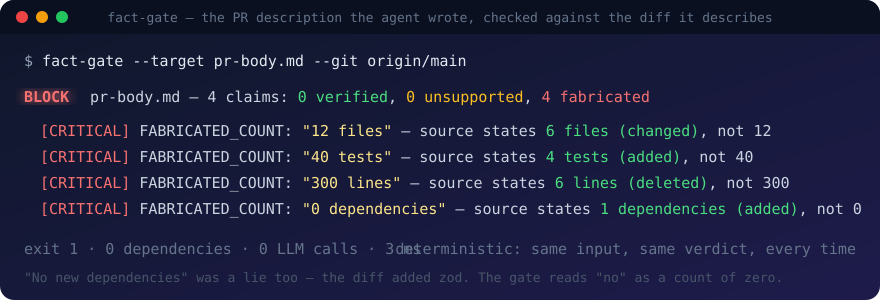
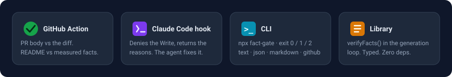
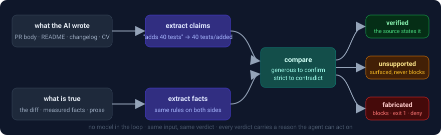

# fact-gate

**Verify what an AI wrote against what is true.**

Your agent writes the PR description, the README, the changelog, the report. Then it rounds a number, inflates a count, invents a date. fact-gate reads every checkable claim in the text, checks each one against the diff, the test suite, or a facts file, and blocks on a contradiction. No second model. No API key. Same input, same verdict, in milliseconds.

<p align="center"></p>

[](https://github.com/AnonZ7/fact-gate/actions/workflows/ci.yml)
[](https://github.com/AnonZ7/fact-gate/actions/workflows/fact-gate.yml)
[](package.json)
[](package.json)
[](LICENSE)

## Try it in half a minute

```bash
# the PR description you are about to post, against the change it describes
npx github:AnonZ7/fact-gate --target pr-body.md --git origin/main

# a README, against numbers measured from the repo itself
npx github:AnonZ7/fact-gate --target README.md --facts .fact-gate.json
```

```
BLOCK  pr-body.md — 4 claims: 0 verified, 0 unsupported, 4 fabricated
  [CRITICAL] FABRICATED_COUNT: "12 files"        — source states 6 files (changed), not 12
  [CRITICAL] FABRICATED_COUNT: "40 tests"        — source states 4 tests (added), not 40
  [CRITICAL] FABRICATED_COUNT: "300 lines"       — source states 6 lines (deleted), not 300
  [CRITICAL] FABRICATED_COUNT: "0 dependencies"  — source states 1 dependencies (added), not 0
```

Exit `0` pass · `1` block · `2` usage error. Every line is a reason the agent can act on, so the fix loop is: feed the report back, regenerate, re-check.

`--git origin/main` diffs your **working tree** against that base, uncommitted edits included. Pass `--git "origin/main HEAD"` to compare commits only. In a GitHub Action checkout the two are the same.

## What it catches

| The AI wrote | The truth | Where the truth comes from |
|---|---|---|
| `Touches 12 files, adds 40 tests` | `6 files, 4 tests` | the PR's own diff (`--git`, `--diff`) |
| `No new dependencies` | `zod` was added | the diff: package.json, requirements, go.mod, Cargo |
| `4,000+ tests pass on every push` | `3,912` | measured: `node --test` output (`--facts`) |
| `Exposes 600 MCP tools` | `585` | measured: `stats.json` (`--facts`) |
| `Cut reconciliation effort by 87%` | `40%` | a spec or profile in prose (`--source`) |
| `Six years of experience` | `4.6` | the earliest role date in the source |
| `Worked at Initech as CTO` | neither exists | employers and titles in the source |

Claim kinds: counts with qualifiers (`85 workflows`, `500+ tools`, `adds 4 tests`, `6 lines deleted`, `no new dependencies`, `roughly 500 skills`, `over 4,000 tests`, `tests: 846`, `6 files: 2 new, 1 deleted, 3 modified`), percentages, amounts, multipliers, years, spelled-out tenure, employers, titles, tools. Negated counts (`does not touch 12 files`) are not claims.

## Where it runs

<p align="center"></p>

### GitHub Action

```yaml
# .github/workflows/fact-gate.yml
on: pull_request
jobs:
  pr-description:                          # the PR body vs the PR diff
    runs-on: ubuntu-latest
    steps:
      - uses: actions/checkout@v4
      - uses: AnonZ7/fact-gate@v1
        with:
          comment: 'true'                  # needs permissions: pull-requests: write

  readme:                                  # the README vs measured facts
    runs-on: ubuntu-latest
    steps:
      - uses: actions/checkout@v4
      - uses: actions/setup-node@v4
      - uses: AnonZ7/fact-gate@v1
        with:
          target: README.md
          facts: .fact-gate.json
          diff: 'false'
```

Annotations on the PR, a step summary listing every claim and every measured fact, and `verdict` / `fabricated` / `report` outputs. Add `comment: 'true'` (with `permissions: pull-requests: write`) for one sticky comment on the PR that is updated on every push. `fail-on: warn` also fails on unsupported claims; `fail-on: never` only reports. This is [what this repository runs on itself](.github/workflows/fact-gate.yml).

### Claude Code hook

```bash
npm install -g fact-gate             # once, so the hook is fast (or: npm i -g github:AnonZ7/fact-gate)
fact-gate init                       # writes .fact-gate.json, prints the two lines below
fact-gate trust .fact-gate.json      # lets the hook run this file's "cmd" measurements
```

```json
{ "hooks": { "PreToolUse": [
  { "matcher": "Write|Edit|MultiEdit",
    "hooks": [ { "type": "command", "command": "fact-gate hook" } ] } ] } }
```

Before a matching file is written, the projected content is checked against the nearest `.fact-gate.json`. A contradiction denies the write and hands the reasons back to the agent, which corrects the figures and tries again. Unsupported claims are allowed and shown, never blocked. No config above the file means the hook is inert. It exits 0 on every failure path; it cannot break a session.

**Trust.** A config can say `{"cmd": "node --test"}`. The hook fires in whatever repository the agent is writing to, so a config in a freshly cloned repo does not get to run commands on your machine: in hook mode, `cmd` measurements run only for a config you have trusted with `fact-gate trust`, which records the file's hash in `~/.fact-gate/trusted.json`. Edit the file and it is untrusted again. Until then literal, `file` and `json` facts still gate, and the agent is told what was skipped. `FACT_GATE_ALLOW_CMD=1` trusts everything, for CI.

### Git pre-commit — every editor, every agent

```bash
fact-gate pre-commit          # checks the STAGED content of covered files; exit 1 refuses the commit
```

| Tool | Wiring |
|---|---|
| husky v9 | `echo "npx fact-gate pre-commit" > .husky/pre-commit` |
| lefthook | `pre-commit: { commands: { fact-gate: { glob: "*.{md,mdx}", run: npx fact-gate pre-commit } } }` |
| pre-commit framework | `- repo: https://github.com/AnonZ7/fact-gate` · `rev: v1.2.0` · `hooks: [{ id: fact-gate }]` |

It reads `git show :path`, so it judges what will be committed, not the working tree. Cursor, Codex, Copilot and humans all go through the same gate.

### CLI

```bash
fact-gate --target pr-body.md --git origin/main            # PR body vs diff
fact-gate --target README.md --facts .fact-gate.json       # docs vs measured facts
fact-gate --target cv.md --source profile.md --jd job.md   # generated text vs prose
fact-gate measure --facts .fact-gate.json                  # show what the facts resolve to
cat draft.md | fact-gate --diff changes.diff --format markdown --strict
```

`--format text | json | markdown | github`. `--ignore-code` drops fenced and inline code (examples are not claims). `--jd` marks a reference text the model was shown, so a figure echoed from it is an echo, not a self-claim.

### Library

```js
import { verifyFacts, formatReport } from 'fact-gate';

const result = verifyFacts(generatedText, {
  diff: gitDiffText,                       // and / or
  facts: { counts: { tests: 3912, 'mcp tools': 585 }, years: [2024], tools: ['n8n'] },
  source: canonicalProseText,
});
result.verdict;      // 'pass' | 'warn' | 'block'
result.fabricated;   // [{ kind, claim, reason, … }]
console.log(formatReport(result));
```

```js
for (let attempt = 0; attempt < 3; attempt++) {
  const draft = await model.generate(prompt);
  const gate = verifyFacts(draft, { diff });
  if (gate.verdict !== 'block') return draft;
  prompt += `\n\nCORRECT THESE:\n${formatReport(gate)}`;   // the reasons are model-readable
}
```

TypeScript declarations included. Zero runtime dependencies. `fact-gate/core` is the browser-safe half (no Node built-ins). Testing from a clone before the npm release: import `./src/index.mjs` by relative path (on Windows, an absolute path must be a `file://` URL).

## Measured facts, not typed ones

A facts file someone typed goes stale the day after: the README says `3,541 tests` while the suite has `3,912`, and a gate happily verifies the stale number. So any value may be a measurement, resolved at check time:

```json
{
  "facts": {
    "counts": {
      "tests":       { "cmd":  "node --test --test-reporter=tap 2>&1", "pattern": "# pass (\\d+)" },
      "eval cases":  { "json": "evals/cases.json",   "path": "cases.length" },
      "mcp tools":   { "file": "docs/STATS.md",      "pattern": "(\\d+) tools" }
    },
    "tools": ["Node.js"]
  },
  "include": [".md"],
  "exclude": ["CHANGELOG.md"]
}
```

The report says what was measured and how. A measurement that fails is an error, never a silent skip. This repository gates its own README this way, against [`.fact-gate.json`](.fact-gate.json): while this section was being written, the gate blocked it once for saying `81 tests` after the suite had grown to 93.

## How it works

<p align="center"></p>

Every claim lands in one of three buckets:

| Bucket | Meaning | Effect |
|---|---|---|
| **verified** | the source states it | — |
| **unsupported** | the source neither states nor contradicts it | reported, never blocking |
| **fabricated** | the source contradicts it | **blocks** |

Extraction runs the same rules on both sides, so a figure the source states one way and the model restates another still meets in the middle. Comparison is deliberately asymmetric:

1. **Verification is generous.** Same noun, same number → verified, qualifiers ignored. `580 tools` is confirmed by `580+ MCP tools`.
2. **A qualified claim meets its own subject first.** `no new dependencies` (0, added) is judged against `dependencies added: 1` and loses; it does not get to match `dependencies deleted: 0` and win.
3. **Floors and approximations are read as written.** `500+`, `over 4,000`, `more than 30` hold when the real figure is at least that and the floor is not an absurd understatement. `roughly 500` holds within `10%`.
4. **Contradiction is strict.** A different number for the *same subject* is fabricated. `2 custom automation tools` and `575 MCP tools` share a plural and nothing else; that is unsupported, not a block.
5. **A kind the source never mentions cannot be contradicted.** If your facts hold no percentages, `42%` is unsupported and surfaced, not fabricated. State one percentage and a different one becomes a lie.

Generous confirmation plus strict contradiction can only produce fewer false blocks. An unmatched claim still surfaces; nothing is silently dropped.

## When the gate is wrong

It will be, sometimes. Every verdict says why, and each answer has a place:

- **A true figure was blocked** because the source is stale. Fix the source, or make that fact a measurement so it cannot go stale.
- **A true figure was blocked** because the facts state a different subject with the same noun. Add the missing figure with its qualifier (`"unit tests": 412`), or add your domain's nouns (`"nouns": ["skus"]`).
- **A figure is true but nowhere in the facts.** Add it. Or, for a one-off, put it in `config.allow_metrics`; the report audits the allow-list and tells you when an entry no longer rescues anything.
- **A claim is unsupported.** Nothing is blocked. Decide whether it should be a fact. Warnings that go unread are the gate's only silent failure, which is why `fail-on: warn` exists for CI.

## Why not ask a model to judge?

| | Approach | Needs a model / GPU / key | Same verdict every run | Reason you can audit |
|---|---|---|---|---|
| LLM-as-judge (promptfoo, deepeval, ragas) | a second model grades the first | yes | no | prose, unverifiable |
| NLI classifiers (LettuceDetect, HHEM, MiniCheck) | token / span entailment model | yes | mostly | a score |
| Guardrails AI, NeMo Guardrails | validator / dialogue-flow frameworks | for free-text checks, yes | depends | depends |
| **fact-gate** | extract claims with rules, compare with rules | **no** | **yes** | `source states 6 files (changed), not 12` |

A judge is the right tool for tone, coherence and reasoning. A wrong number is not a judgement call. It is a lookup, and a lookup should be deterministic, free, and explainable.

## Measured, not asserted

The gate is evaluated the way you would evaluate the model it polices. `npm run eval` runs 77 cases in 3 suites and reports precision and recall on the block decision, per suite, so a weak domain cannot hide in the average:

```
cv-vs-profile      cases:  34   precision: 100.0%   recall: 100.0%   false-blocks: 0   missed: 0
pr-body-vs-diff    cases:  24   precision: 100.0%   recall: 100.0%   false-blocks: 0   missed: 0
docs-vs-facts      cases:  19   precision: 100.0%   recall: 100.0%   false-blocks: 0   missed: 0
```

**False blocks are the number to watch.** A gate that rejects true statements gets whitelisted around, and a whitelisted gate is worse than none. `result.allowlist.unused` exists for the same reason: an allow-list entry that rescues nothing is stale or hiding a fixed bug, and the report says so.

97 tests run on Node 20, 22 and 24, on Linux and Windows. Five of them are dated production regressions from the gate's first week, reproduced against the old code before being fixed; six more pin the findings of a pre-release adversarial review (a negated count that was blocked, fullwidth digits that were invisible, a heading word that laundered a fabrication into a warning) and a security test that proves a config runs nothing for files it does not cover. This paragraph has been blocked twice by the repo's own gate for stating a stale test count.

| | Defect | What it did |
|---|---|---|
| B1 | trailing sub-count `…, 32 in daily production` not extracted | **blocked a true sentence** as fabricated |
| B2 | floor judged against the smallest figure, not the best match | wrong figure in the message, wrong verdict |
| B3 | number token spanned a sentence boundary: `2024. 32` | produced the claim `2024. 32 workflows` |
| B4 | parenthetical breakdown `(Playwright 461 + …)` not extracted | a real figure reported as unsupported |
| B5 | bare claim vs qualified source treated as incomparable | `580 tools` unsupported against `580+ MCP tools` |

B1 is the one that matters. A gate that rejects the truth does not just fail once; it trains whoever runs it to override it.

## What it does not do

- **Per-file figures.** `removes 3 lines from legacy.mjs` is checked against the repository-level totals; if 3 is not one of them, it is surfaced as unsupported, not blocked.
- **Judgement.** It passed a cover letter that quoted the employer's salary band back and pre-agreed to it. Numbers are checkable; posture is not.
- **A stale source.** If your facts say `3,541 tests` and the suite has `3,912`, the gate verifies `3,541`. Under-claiming is invisible to every rule here. That is why facts can be measured.
- **Silence.** `Served 50k users` against a source that never counts users is unsupported. It is shown to a human. That is the honest answer.
- **Other languages, semantic paraphrase, general NLI.** English prose only. It is a set of rules for one specific, common, expensive failure: a model restating your numbers, dates, names and tools wrong.

## Extending

```js
import { createExtractor, verifyFacts } from 'fact-gate';

verifyFacts(text, { source, nouns: ['skus', 'orders'], synonyms: { sku: 'skus' } });
verifyFacts(text, { diff, floorRatio: 0.5, approxTolerance: 0.1 });
```

`.fact-gate.json` is described by [`schema/fact-gate.schema.json`](schema/fact-gate.schema.json). `fact-gate measure` prints what the facts resolve to. `evals/run.mjs --json` emits the numbers above for your own dashboards.

## Provenance

The claim-shape regular expressions and the "widen the modifier window, bind lazily" extraction rules derive from [career-ops](https://github.com/career-ops-hq/career-ops) (MIT, © 2026 Santiago Fernández de Valderrama). The three-way classification, the asymmetric comparison rules, floor and approximate checking, the diff parser, measured facts and the trust model, breakdown / sub-count / noun-first / verb-qualified / spelled-count extraction, the allow-list audit, the CLI, the Action, the hook, the eval harness and the tests are original to this project. See [NOTICE](NOTICE).

## License

MIT — see [LICENSE](LICENSE).
